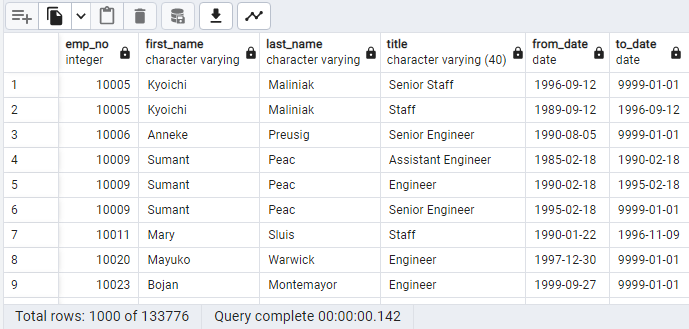
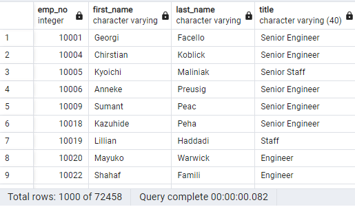
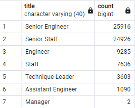
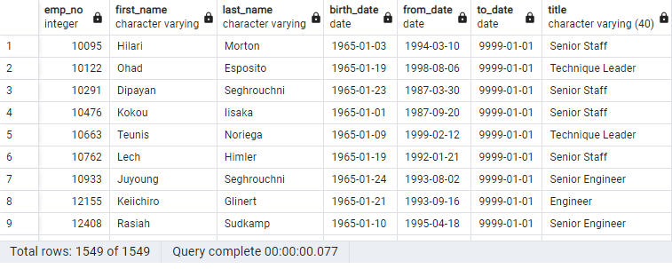

# Pewlett-Hackard-Analysis using SQL

## Overview of Analysis

Pewlett Hackard, a major company consisting of several thousand employees, would like an analysis done to consolidate a list of employees who meet certain criteria to retire, as well as identify all employees who are eligible to participate in a mentorship program.

To accomplish our assignment of providing 2 deliverables, we were given 6 data samples that include "departments", "employees", "managers", "dept_emp", "salaries", and "titles." With these datasets, we joined the employees and titles tables to retrieve the number of retiring employees by title. To identify those employees who are retiring, we used the WHERE clause to identify those employees with birthdays between January 01, 1952 and December 31, 1955. The output data was saved and exported as a CSV file called "retirement_titles."

Next, we created a new "unique_titles" table to remove duplicate rows by using the DISTINCT ON clause. Furthmore we identified the number of employees who are about to retire by their most recent job title and exported this data as "retiring_titles."

For deliverable 2, we pulled the first name, last name, and birth date from the employees table, the from and to dates from the dept_emp table, and finally, the title from the titles table. With this information, we were able to identify the current employees eligible for Pewlett Hackard's mentorship program.

 

## Overview of Analysis

- In a matter of 10 years, Sumant Peac was promoted 3 times. Hired as an Assistant Engineer, they currently hold the position of a Senior Engineer.

 
 
- There are currently 72,458 employees eligible for retirement.

 
 
- Almost 26,000 of the 72,458 employees retiring are Senior Engineers.

 
 
- 1,549 employees are eligible for Pewlett Hackard's mentorship program.

 

## Summary & Conclusion

Our analysis reveals that Pewlett Hackard is expected to face a huge percentage of its workforce being eligible to retire. With most retirements consisting of senior staff, Pewlett Hackard will have to begin looking into promotions of less-senior staff and recruit more individuals to fill those roles after promotions are given. 

As for the mentorship program, mentors will be outnumbered. Allocating roughly 50 individuals per mentor, it is unrealistic with the amount of openings and eligible retirements. Understandably, all positions would not be filled simultaneously which may provide some sustainability to the mentorship program.

Further queries we can run to provide more information would be to calculate how many senior staff are eligible for the program compared to less-senior staff. Furthermore, we can look into the amount of applications the company receives and how frequently new positions are filled to indicate if the company would be able to replace its retiring workforce and determine whether the mentorship program would be flooded immediately with mentees.